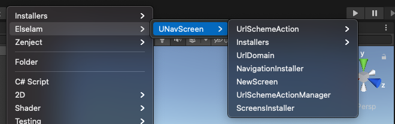
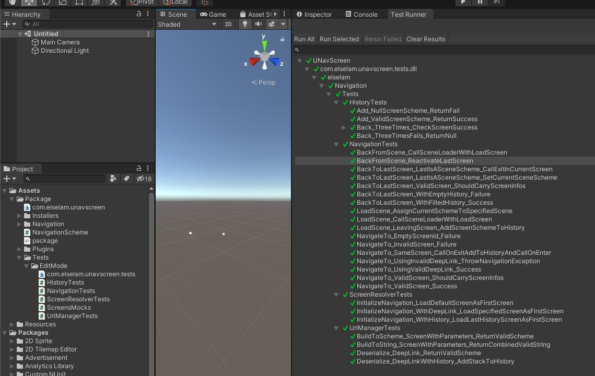

# Unity Router

Framework for Unity screens navigation with full support to deep link
You can control the navigation for your game or app using prefabs, scenes or both.

# Install

- In the Unity package manager window, you can add package from git url like "https://github.com/victor-elselam/unity-router.git?path=/Assets/Package"

or 

- (Work in progress)Using subtree "upm" with https://github.com/mob-sakai/UpmGitExtension. Add "https://github.com/victor-elselam/unity-router.git" and select releases 

# Get Started

# Unit Tests

# Nexts Steps

- Support for deep link in the middle of a session (high priority)
- Refactor 'Navigation' names to 'UnityRouter'
- Add support for an extern logger to give more control of those logs for your system
- Add event when a specific parameter is found in deep links/navigations (with this, we can remove History methods from UrlManager, also, give a lot of flexibility for the framework)
- Create a Scene dragger to the inspector, to avoid missing reference when change scene name
- Create an adapter for Unity DeepLink receiver, avoiding our classes to be coupled with it.

# Samples

# Sample 1 - Using with Dependency Injection
ChangeSceneSample - To Test it, just open the 'ChangeSceneSample' scene, hit play, and navigate through the different screens/scenes
# Sample 2 - Using without Dependency Injection
UsageWithoutDependencyInjection - To Test it, just open the 'UsageWithoutDependencyInjection' scene, hit play, and navigate through the different screens/scenes.

In both of them, maybe you'll need to add the scenes to the Build Settings. For some reason, Unity keeps changing the AssetID and the reference goes away.

# Dependencies

"com.boundfoxstudios.fluentassertions": "https://github.com/BoundfoxStudios/fluentassertions-unity.git#5.10.3-r5", \
"com.cysharp.unitask": "https://github.com/Cysharp/UniTask.git#2.2.5", \
"com.svermeulen.extenject": "https://github.com/starikcetin/Extenject.git#9.1.0"
